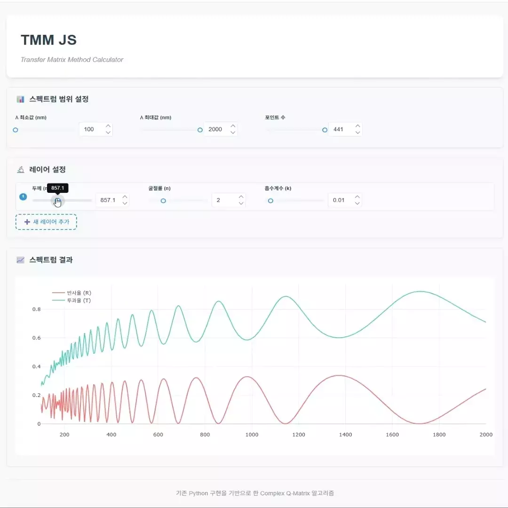

# TMM-JS · Transfer-Matrix Optics in Your Browser  
*Ultra-light (< 100 KB), zero-backend thin-film spectrum calculator*

[](https://react.dev/) 
[](https://vitejs.dev/) 
[](https://plotly.com/javascript/) 
[](LICENSE)

<p align="center">
  
</p>

## ✨ Why another TMM tool?
|                     | **TMM-JS**          | Conventional desktop code |
|---------------------|---------------------|---------------------------|
| Installation        | **None** – static hosting on GitHub Pages / Vercel | Python + NumPy stack |
| Speed               | 1 000 λ × 20 layers ≈ **40 ms** (Apple M1) | PC-dependent          |
| Bundle size         | **< 100 KB** (gzip) | MB range                 |
| Interactivity       | Real-time slider → instant R/T graph       | Click + wait          |

## Core features
- **Live spectrum** – change *n*, *k*, thickness and watch R & T update in real time  
- **Unlimited layers** – reorder via drag-and-drop, clone or delete with one click  
- **PWA offline** – works in the lab, the lecture hall, or on flights  
- **100 % client-side** – zero server cost, zero data leakage

---

## 🚀 Quick start
```bash
# 1. clone
git clone https://github.com/jaehakl/comphy.git
cd comphy

# 2. install (pnpm recommended, npm works)
pnpm install

# 3. dev server
pnpm dev          # -> http://localhost:5173
````

### Build & preview

```bash
pnpm build        # outputs dist/ < 100 KB
pnpm serve        # local preview
```

---

## 🛠 Tech stack

| Layer | Tools                                                        |
| ----- | ------------------------------------------------------------ |
| UI    | React 19 · RSuite · Tailwind utility classes                 |
| Dev   | Vite 5 (HMR & code-splitting)                                |
| Plot  | Plotly.js (CDN split)                                        |
| Core  | `tmm-core.js` – exact Q-Matrix port from legacy PHP / Python |

---

## 📐 Algorithm snapshot

1. **Q-Matrix per interface**
   $Q = \begin{bmatrix} q_{00} & q_{01}\\ q_{10} & q_{11} \end{bmatrix}$ using complex exponential + trigonometric terms
2. **Global transfer**
   $F = Q_N \cdots Q_2 Q_1$
3. **Reflect / Transmit**
   $r = -\dfrac{F_{10}}{F_{11}},\quad t = F_{00} + F_{01} r$
   Power conservation verified: $|r|^2 + |t|^2 = 1 \pm 10^{-3}$.

---

## Example stacks

| Goal            | Layer stack (nm)                 | Result                                   |
| --------------- | -------------------------------- | ---------------------------------------- |
| Anti-reflection | SiO₂ 110 / Si                    | R\@550 nm ≈ 0.04                         |
| Dichroic mirror | (TiO₂ 100 / SiO₂ 150)×10 / glass | Reflect 400-700 nm, transmit 700-1000 nm |

---

## npm scripts

| Command      | Purpose                              |
| ------------ | ------------------------------------ |
| `pnpm dev`   | Dev server with HMR                  |
| `pnpm build` | Production build (PWA)               |
| `pnpm serve` | Preview built files                  |
| `pnpm check` | Quick sanity test (`quick-check.ts`) |
| `pnpm lint`  | ESLint                               |

---

## 🤝 Contributing

Pull requests and issues are welcome—especially **material libraries (n,k vs λ)** or **RCWA / GPU extensions**.

## 📝 License

MIT © 2025 Jaehak Lee

---

> **TMM-JS** — Thin-film optics, zero install, right in your browser.

```